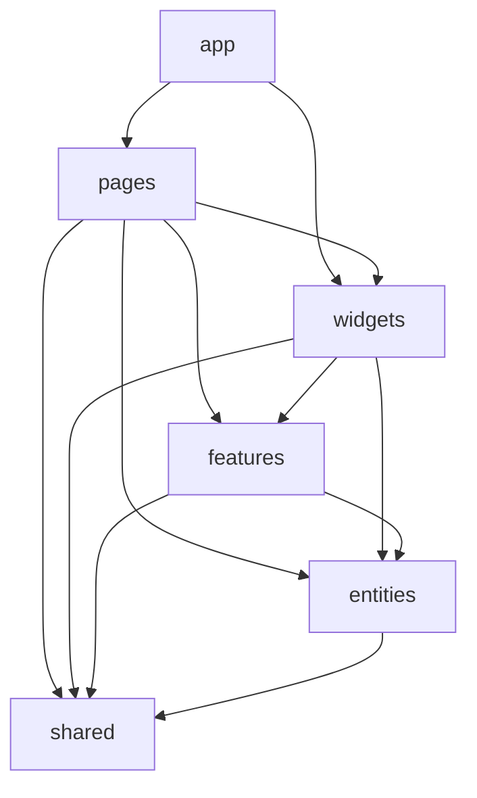

# Rastroom

[](https://react.dev/)
[](https://www.typescriptlang.org/)
[](https://vitejs.dev/)
[](https://nodejs.org/)

Sistema de rastreabilidade de peças de móveis com QR Code — romaneio, pedidos, clientes, peças, móveis, scanner, montagem e expedição.

---

## Índice (Table of Contents)

- [Rastroom](#rastroom)
  - [Índice (Table of Contents)](#índice-table-of-contents)
  - [1. Visão Geral e Propósito](#1-visão-geral-e-propósito)
    - [O que é o projeto](#o-que-é-o-projeto)
    - [Problema que resolve](#problema-que-resolve)
    - [Como funciona em alto nível](#como-funciona-em-alto-nível)
  - [2. Arquitetura do Projeto (Feature-Sliced Design — FSD)](#2-arquitetura-do-projeto-feature-sliced-design--fsd)
    - [Camadas utilizadas](#camadas-utilizadas)
    - [Regra de ouro das dependências](#regra-de-ouro-das-dependências)
    - [Onde colocar novo código](#onde-colocar-novo-código)
  - [3. Guia de Contribuição e Git Workflow](#3-guia-de-contribuição-e-git-workflow)
    - [Estratégia de branching](#estratégia-de-branching)
    - [Conventional Commits](#conventional-commits)
    - [Fluxo de Pull Request (PR)](#fluxo-de-pull-request-pr)
  - [4. Stack Tecnológica](#4-stack-tecnológica)
  - [5. Configuração e Instalação (Setup Local)](#5-configuração-e-instalação-setup-local)
    - [Pré-requisitos](#pré-requisitos)
    - [Passo a passo (frontend)](#passo-a-passo-frontend)
    - [Backend (opcional)](#backend-opcional)
    - [Gerenciamento de pacotes](#gerenciamento-de-pacotes)
  - [6. Scripts Disponíveis](#6-scripts-disponíveis)
  - [7. Referências](#7-referências)

---

## 1. Visão Geral e Propósito

### O que é o projeto

**Rastroom** (pacote `rastroom-platform`) é uma plataforma para **rastreabilidade de peças de móveis** usando QR Code. Cobrem-se romaneio, pedidos, clientes, peças, móveis, scanner de códigos, processos (corte, etc.), montagem, expedição e dashboards operacionais.

### Problema que resolve

- **Negócio:** Rastrear peças ao longo do fluxo (corte → processos → montagem → expedição), associá-las a pedidos e clientes, e dar visibilidade operacional (dashboard, tempos por processo).
- **Técnico:** Manter uma SPA moderna (PWA) que consome uma API REST única, com autenticação e experiência adequada em ambiente de fábrica/armazém.

### Como funciona em alto nível

- **Frontend:** Aplicação React (Vite) na porta **8080** — SPA com roteamento, autenticação e consumo da API REST.
- **Backend:** API Java (Spring Boot) na porta **8081** — persiste dados em **PostgreSQL** e pode usar **Redis** (cache/sessão). Autenticação **JWT**.
- **PWA:** O frontend é instalável e pode funcionar em campo com suporte offline básico (cache de assets e estratégia para API).

Fluxo resumido: utilizador faz login → acede a clientes, pedidos, peças, scanner, processos, montagem, expedição e dashboards; o frontend chama `/api/*`, o proxy em desenvolvimento reencaminha para o backend em 8081.

---

## 2. Arquitetura do Projeto (Feature-Sliced Design — FSD)

O frontend segue **Feature-Sliced Design (FSD)**. Todo o código da aplicação React está em **`core/frontend/src/`**. O Vite está configurado com o alias **`@`** apontando para `core/frontend/src` (ex.: `import { Button } from '@/shared/ui/button'`).

### Camadas utilizadas

As camadas, da **mais alta** (mais próxima do utilizador e da aplicação) à **mais baixa** (reutilizável e independente de negócio), são:

| Camada       | Descrição                                       | Exemplos no projeto                                                                                                              |
| ------------ | ----------------------------------------------- | -------------------------------------------------------------------------------------------------------------------------------- |
| **app**      | Inicialização, roteamento, providers globais    | `App.tsx`, `main.tsx`, `router/ProtectedRoute.tsx`, `styles/global.css`                                                          |
| **pages**    | Páginas por rota                                | `dashboard`, `clients`, `orders`, `furniture`, `parts`, `scanner`, `processes`, `assembly`, `expedition`, `install`, `not-found` |
| **widgets**  | Blocos compostos reutilizáveis (layout, seções) | `app-layout`, `app-sidebar`, `auth-form` (Login)                                                                                 |
| **features** | Ações de usuário reutilizáveis                  | `import-parts` (ImportPartsDialog)                                                                                               |
| **entities** | Modelos e lógica de domínio                     | `user` (AuthContext, tipos User/Session), `order` (order-constants)                                                              |
| **shared**   | UI primitiva, hooks, utils                      | `button`, `input`, `dialog`, `table`, `use-toast`, `use-mobile`, `lib/utils`                                                     |

Cada página vive em `pages/<nome>/ui/<Nome>Page.tsx` (ou equivalente). Não existe camada "processes" — "Processes" é uma **página** em `pages/processes/`.

### Regra de ouro das dependências

Um módulo **só pode importar de camadas inferiores**. Não pode importar de camadas superiores nem da mesma camada (entre slices diferentes).

- **shared** → não importa de nenhuma outra camada FSD.
- **entities** → pode importar apenas de `shared`.
- **features** → pode importar de `entities` e `shared`.
- **widgets** → pode importar de `features`, `entities` e `shared`.
- **pages** → pode importar de `widgets`, `features`, `entities` e `shared`.
- **app** → pode importar de todas as camadas abaixo.

Diagrama (direção das dependências):



### Onde colocar novo código

| O quê                                                        | Onde                    |
| ------------------------------------------------------------ | ----------------------- |
| Componente de UI genérico (botão, input, card)               | **shared/ui**           |
| Tipo ou modelo de domínio (ex.: Order, User)                 | **entities/<entidade>** |
| Ação de usuário reutilizável (ex.: dialog de importar peças) | **features/<feature>**  |
| Bloco de layout ou seção reutilizável (sidebar, header)      | **widgets/<widget>**    |
| Tela ligada a uma rota                                       | **pages/<page>/ui**     |
| Rotas, providers globais, estilos globais                    | **app**                 |

Ao criar um novo componente ou módulo, pergunte: "Quem pode importar isto?" Se for só uma tela, fica em **pages**. Se for reutilizado em várias telas como bloco, **widgets**. Se for uma ação (ex.: modal de importação), **features**. Se for entidade de domínio, **entities**. Se for peça de UI sem regra de negócio, **shared**.

---

## 3. Guia de Contribuição e Git Workflow

Este resumo alinha a equipa; o documento completo está em **[docs/GUIDE.md](docs/GUIDE.md)** (convenções, testes, qualidade, quando pedir ajuda).

### Estratégia de branching

| Branch      | Uso                                                                                   |
| ----------- | ------------------------------------------------------------------------------------- |
| **main**    | Código em produção. Só recebe merge de `develop` ou, em emergência, de `hotfix/*`.    |
| **develop** | Integração contínua. Features e correções são mergeadas aqui antes de ir para `main`. |

Branches de trabalho (criar sempre a partir de **develop**):

| Prefixo       | Exemplo                   | Uso                                      |
| ------------- | ------------------------- | ---------------------------------------- |
| **feature/**  | `feature/scanner-offline` | Nova funcionalidade                      |
| **bugfix/**   | `bugfix/login-redirect`   | Correção de bug em desenvolvimento       |
| **hotfix/**   | `hotfix/security-patch`   | Correção urgente a partir de `main`      |
| **refactor/** | `refactor/orders-api`     | Refatoração sem mudança de comportamento |
| **docs/**     | `docs/development-guide`  | Apenas documentação                      |
| **chore/**    | `chore/upgrade-vite`      | Config, deps, tooling                    |

Fluxo resumido:

1. Atualizar `develop`: `git fetch origin && git checkout develop && git pull --rebase origin develop`
2. Criar branch: `git checkout -b feature/nome-da-feature`
3. Commits seguindo Conventional Commits **em inglês**
4. Antes de abrir PR: atualizar de novo com `develop`, garantir lint e testes
5. Abrir Pull Request de `feature/...` (ou `bugfix/...`) para **develop**
6. Após revisão e aprovação, merge em `develop`; deploy para produção via merge de `develop` em `main` (conforme pipeline do time)

### Conventional Commits

Todas as mensagens de commit devem seguir [Conventional Commits](https://www.conventionalcommits.org/) e ser escritas **em inglês** (internacional).

Formato: `tipo(escopo): descrição curta no imperativo`

| Tipo         | Uso                                 | Exemplo                                           |
| ------------ | ----------------------------------- | ------------------------------------------------- |
| **feat**     | Nova funcionalidade                 | `feat(scanner): add camera-based QR scan`         |
| **fix**      | Correção de bug                     | `fix(auth): redirect to login after logout`       |
| **chore**    | Build, deps, config, tooling        | `chore(deps): upgrade react-query to 5.90`        |
| **refactor** | Refatoração sem mudar comportamento | `refactor(pages): extract orders table to widget` |
| **docs**     | Apenas documentação                 | `docs: add FSD architecture section to README`    |
| **test**     | Testes                              | `test(entities): add AuthContext unit tests`      |
| **style**    | Formatação (Prettier, etc.)         | `style(shared): run Prettier on ui/`              |
| **perf**     | Melhoria de performance             | `perf(build): add Vite manualChunks for vendor`   |

**Escopo:** use a camada FSD ou o módulo afetado (ex.: `app`, `pages`, `widgets`, `features`, `entities`, `shared`, ou nome da página/feature como `scanner`, `orders`).

Exemplos corretos:

```text
feat(widgets): add global header component
fix(pages): fix orders filter by status
chore(build): remove build:dev script for Vercel
refactor(entities): move Order types to entities/order
docs: add development guide and commit conventions
test(shared): add useToast tests
```

Exemplos incorretos:

```text
Adicionei o botão          # Não convencional, em português
feat: novo componente       # Português; preferir "add X component"
fix bug                    # Sem escopo; "fix(scope): describe the fix"
```

### Fluxo de Pull Request (PR)

Antes de abrir um PR:

1. **Lint:** `npm run lint` sem erros.
2. **Testes:** `npm test` passando.
3. **Build:** `npm run build` concluindo (recomendado, principalmente antes de abrir PR).

O PR deve ser aberto **sempre para `develop`**. A descrição deve explicar o que mudou e o porquê. Para regras de testes (quando e onde adicionar), qualidade de código e quando pedir ajuda, ver **[docs/GUIDE.md](docs/GUIDE.md)**.

---

## 4. Stack Tecnológica

| Área                      | Tecnologias                                                                                                                                                                                                                                                     |
| ------------------------- | --------------------------------------------------------------------------------------------------------------------------------------------------------------------------------------------------------------------------------------------------------------- |
| **Frontend**              | React 18, TypeScript 5, Vite 5, React Router 6, TanStack React Query 5, Tailwind CSS 3, Radix UI (primitives), React Hook Form + Zod + @hookform/resolvers, Recharts, date-fns, Lucide React, Sonner/Toaster, html5-qrcode, qrcode.react, vite-plugin-pwa (PWA) |
| **Build / Lint / Testes** | Vite (build e dev server), ESLint 9, Vitest + Testing Library                                                                                                                                                                                                   |
| **Backend**               | Java 21, Spring Boot 3.x, Maven, PostgreSQL 16, Redis 7 (opcional). Ver [docs/BACKEND-JAVA-GUIDE.md](docs/BACKEND-JAVA-GUIDE.md)                                                                                                                                |
| **Ferramentas**           | npm (gerenciador de pacotes na raiz), Docker e Docker Compose (backend e infra)                                                                                                                                                                                 |

---

## 5. Configuração e Instalação (Setup Local)

### Pré-requisitos

- **Node.js** 18+ e **npm** (para o frontend).
- (Opcional, para backend) **JDK 21**, **Maven 3.9+**, **Docker** (para PostgreSQL e Redis).

### Passo a passo (frontend)

1. **Clonar o repositório**

   ```bash
   git clone <url-do-repositorio>
   cd platform-rastroom
   ```

2. **Instalar dependências**

   ```bash
   npm install
   ```

3. **Variáveis de ambiente**

   Copiar o ficheiro de exemplo e editar se necessário:

   ```bash
   cp .env.example .env
   ```

   O ficheiro `.env` não é commitado (está no `.gitignore`). Conteúdo típico:

   | Variável         | Descrição                      | Desenvolvimento                                                      |
   | ---------------- | ------------------------------ | -------------------------------------------------------------------- |
   | **VITE_API_URL** | URL base da API (backend Java) | `http://localhost:8081` ou vazio se usar apenas o proxy (ver abaixo) |

   Em desenvolvimento, o Vite tem **proxy** configurado: pedidos a `/api` são reencaminhados para `http://localhost:8081`. Por isso, pode usar `VITE_API_URL=''` ou não definir; as chamadas a `/api/...` passam pelo proxy. Em produção, defina `VITE_API_URL` com o URL público do backend.

4. **Subir o frontend**

   ```bash
   npm run dev
   ```

   A aplicação fica disponível em **http://localhost:8080**.

### Backend (opcional)

- Para subir apenas **PostgreSQL** e **Redis**: `docker compose up -d postgres redis` (na raiz do repositório).
- Para rodar o backend Java localmente (perfil `dev`, porta 8081), seguir **[docs/BACKEND-JAVA-GUIDE.md](docs/BACKEND-JAVA-GUIDE.md)** (pré-requisitos, perfis, variáveis).
- Para subir a stack completa (backend + postgres + redis): `docker compose up -d` (requer que exista `core/backend-java` com Dockerfile).

O diretório `core/backend-java` é referenciado no `docker-compose.yml` e na documentação; se não existir no clone, o backend é opcional e o frontend pode usar mocks ou API externa.

### Gerenciamento de pacotes

Utiliza-se **npm** na raiz do repositório. As dependências do frontend estão no `package.json` da raiz. Não há monorepo com workspaces; o código do frontend está em `core/frontend/src/` e o entry point é referenciado no `index.html` na raiz.

---

## 6. Scripts Disponíveis

| Script         | Comando              | Propósito                                           |
| -------------- | -------------------- | --------------------------------------------------- |
| **dev**        | `npm run dev`        | Servidor de desenvolvimento Vite (porta 8080, HMR). |
| **build**      | `npm run build`      | Build de produção (Vite).                           |
| **preview**    | `npm run preview`    | Pré-visualização do build de produção.              |
| **lint**       | `npm run lint`       | Executa o ESLint em todo o projeto.                 |
| **test**       | `npm test`           | Vitest — execução única dos testes.                 |
| **test:watch** | `npm run test:watch` | Vitest em modo watch (desenvolvimento).             |

---

## 7. Referências

- **[docs/GUIDE.md](docs/GUIDE.md)** — Guia de desenvolvimento: Conventional Commits, branching, testes, qualidade de código, onde colocar testes, quando pedir ajuda.
- **[docs/BACKEND-JAVA-GUIDE.md](docs/BACKEND-JAVA-GUIDE.md)** — Backend Java: arquitetura, Docker, contrato da API (Auth, Clients, Orders, Furniture, Parts, Scanner, Assembly, Expedition, Dashboard), setup local para o dev Java, CORS e variáveis de ambiente.

Com este README e os dois guias acima, um desenvolvedor pleno ou sénior pode entender a arquitetura FSD, rodar o projeto e fazer o primeiro commit dentro dos padrões da equipa sem precisar de perguntas básicas.
