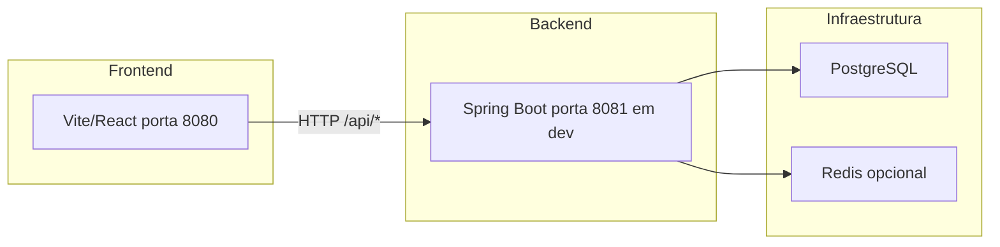

# Guia do Backend Java — Rastroom

Este documento é o guia principal para o desenvolvedor Java que irá implementar e manter o backend definitivo da plataforma Rastroom. Inclui conceitos de Docker, arquitetura, ligação frontend–backend, contrato da API e passos de implementação.

---

## 1. Introdução e objetivo

O **backend Java** (em `core/backend-java/`) é a API da Rastroom (Spring Boot). Contém o domínio, serviços, repositórios e controllers REST.

**Stack:**

- **Runtime:** Java 21 (LTS)
- **Framework:** Spring Boot 3.x
- **Build:** Maven
- **Base de dados:** PostgreSQL
- **Cache/sessão (opcional):** Redis
- **Containerização:** Docker e Docker Compose

---

## 2. O que é Docker (para o dev Java)

### Conceitos

- **Imagem:** É a “receita” do que corre no container. Inclui um sistema operativo mínimo, o runtime (ex.: JRE) e a aplicação (ex.: JAR). No nosso caso, o `Dockerfile` em `core/backend-java/` define uma imagem multi-stage: uma etapa compila o projeto com Maven, outra cria a imagem final só com o JAR e o JRE.

- **Container:** É uma instância em execução de uma imagem. Corresponde a um processo isolado no sistema: tem o seu próprio sistema de ficheiros e rede. O backend Java corre dentro de um container quando usas `docker compose up`.

- **Docker Compose:** Orquestra vários serviços (backend, PostgreSQL, Redis) numa rede interna, com volumes para persistência e variáveis de ambiente. O ficheiro `docker-compose.yml` na raiz do repositório define estes serviços. Em desenvolvimento, podes subir só a base de dados e o Redis e correr a aplicação Java na tua máquina com Maven.

### Porquê usar Docker

- **Ambiente igual** em desenvolvimento, CI e produção.
- **Subir só dependências:** `docker compose up -d postgres redis` e desenvolver a app localmente contra a BD em container.
- **Testar a stack completa:** `docker compose up -d` sobe backend + PostgreSQL + Redis.

Para comandos concretos (subir serviços, logs, parar), ver a secção 6 do [README.md](../README.md) (“Docker — Backend Java”).

---

## 3. Arquitetura do projeto

Em alto nível, o frontend (React/Vite) chama a API REST do backend Java; o backend persiste dados no PostgreSQL e pode usar Redis para cache/sessão.



- **Frontend:** Aplicação React (porta 8080 em dev). Consome a API em `/api/*`.
- **Backend:** API REST Spring Boot. Em desenvolvimento local usa a porta **8081** para não conflitar com o frontend. Dentro do Docker continua a ouvir na porta 8080 (mapeada para 8081 no host).
- **PostgreSQL:** Base de dados principal (pedidos, clientes, peças, móveis, utilizadores, etc.).
- **Redis:** Opcional; para sessão ou cache quando configurado.

---

## 4. Como o frontend se conecta ao backend

### URL da API

A URL base da API é configurável no frontend através da variável de ambiente **`VITE_API_URL`** (ex.: `http://localhost:8081`). O frontend usa `import.meta.env.VITE_API_URL` para montar as chamadas, por exemplo:

- `${VITE_API_URL}/api/orders`
- `${VITE_API_URL}/api/auth/sign-in`

O ficheiro `.env.example` na raiz contém `VITE_API_URL=http://localhost:8081`. Em produção, deve apontar para o URL público do backend.

### Desenvolvimento local

- O frontend corre na **porta 8080** (Vite).
- O backend corre na **porta 8081** (ou via Docker com mapeamento `8081:8080`).
- No `.env` do frontend: `VITE_API_URL=http://localhost:8081`.

### Proxy Vite (recomendado em dev)

No `vite.config.ts` está configurado um **proxy**: pedidos a `/api` são reencaminhados para `http://localhost:8081`. Assim:

- O frontend pode usar caminhos relativos como `fetch('/api/orders')` (mesma origem).
- Podes usar `VITE_API_URL=''` ou não definir; as chamadas a `/api/...` passam pelo proxy para o backend.
- Em dev reduz a necessidade de CORS para desenvolvimento.

### CORS

O backend está configurado (classe `WebConfig`) para aceitar pedidos das origens do frontend em desenvolvimento:

- `http://localhost:8080`
- `http://localhost:5173`
- `http://127.0.0.1:8080`
- `http://127.0.0.1:5173`

Em produção, deve restringir-se à origem do frontend deployado (por exemplo via variável de ambiente `CORS_ALLOWED_ORIGINS`).

### Autenticação

O backend implementa autenticação JWT:

- **Login:** `POST /api/auth/sign-in` com `{ "email": "...", "password": "..." }`; o backend devolve `{ "user": {...}, "token": "..." }`.
- **Registo:** `POST /api/auth/sign-up` com `{ "email": "...", "password": "...", "fullName": "..." }`.
- O frontend deve guardar o token e enviá-lo em cada pedido no header: `Authorization: Bearer <token>`.
- **Sessão:** `GET /api/auth/me` (com token) devolve o utilizador atual.

Utilizador inicial (criado automaticamente se a base estiver vazia): **admin@rastroom.com** / **admin123**. Alterar a palavra-passe após o primeiro acesso.

---

## 5. Contrato da API (referência para implementação)

A lista abaixo define os recursos e endpoints REST que o backend expõe. Os DTOs e entidades estão em `core/backend-java/` (domain, presentation.dto).

### Auth

| Método | Caminho | Descrição |
|--------|--------|-----------|
| POST   | `/api/auth/sign-in`  | Login (email, password); devolve utilizador e token. |
| POST   | `/api/auth/sign-out` | Terminar sessão. |
| GET    | `/api/auth/me`       | Utilizador atual (requer autenticação). |

### Clients

| Método | Caminho | Descrição |
|--------|--------|-----------|
| GET    | `/api/clients`        | Listar todos os clientes. |
| POST   | `/api/clients`        | Criar cliente. |
| PUT    | `/api/clients/:id`    | Atualizar cliente. |
| DELETE | `/api/clients/:id`    | Remover cliente. |
| GET    | `/api/clients/for-select` | Lista resumida para selects (id, name). |

### Orders

| Método | Caminho | Descrição |
|--------|--------|-----------|
| GET    | `/api/orders`         | Listar todos os pedidos. |
| POST   | `/api/orders`        | Criar pedido. |
| PUT    | `/api/orders/:id`    | Atualizar pedido. |
| DELETE | `/api/orders/:id`    | Remover pedido. |
| GET    | `/api/orders/for-select` | Lista resumida para selects. |

### Furniture

| Método | Caminho | Descrição |
|--------|--------|-----------|
| GET    | `/api/furniture`      | Listar móveis. |
| POST   | `/api/furniture`      | Criar móvel. |
| DELETE | `/api/furniture/:id`  | Remover móvel. |
| GET    | `/api/furniture/for-orders` | Lista para associação a pedidos. |

### Parts

| Método | Caminho | Descrição |
|--------|--------|-----------|
| GET    | `/api/parts`         | Listar peças. |
| POST   | `/api/parts`         | Criar peça. |
| DELETE | `/api/parts/:id`     | Remover peça. |
| POST   | `/api/parts/import`   | Importar peças (ex.: planilha). |
| GET    | `/api/parts/furniture-list` | Lista de móveis para filtros/selects. |

### Scanner

| Método | Caminho | Descrição |
|--------|--------|-----------|
| GET    | `/api/scanner/part/:code` | Obter peça por código (ex.: QR). Alternativa: POST com body. |

### Assembly

| Método | Caminho | Descrição |
|--------|--------|-----------|
| GET    | `/api/assembly/lookup/:kitCode`   | Dados do kit (peça-mãe e peças-filhas) para montagem. |
| POST   | `/api/assembly/finalize/:kitId`   | Finalizar montagem do kit. |

### Expedition

| Método | Caminho | Descrição |
|--------|--------|-----------|
| GET    | `/api/expedition/ready`           | Pedidos prontos para expedição. |
| POST   | `/api/expedition/:orderId/mark-expedited` | Marcar pedido como expedido. |

### Dashboard

| Método | Caminho | Descrição |
|--------|--------|-----------|
| GET    | `/api/dashboard/stats`            | Estatísticas gerais (pendentes, etc.). |
| GET    | `/api/dashboard/process-times`   | Tempos médios por processo. |
| GET    | `/api/dashboard/parts-by-process`| Contagem de peças por processo. |

Os DTOs e entidades JPA estão implementados em `com.rastroom.domain` e `com.rastroom.presentation.dto`.

---

## 6. Setup local para o dev Java

### Pré-requisitos

- **JDK 21**
- **Maven 3.9+**
- **Docker** (opcional; recomendado para PostgreSQL e Redis)
- IDE (IntelliJ, Eclipse, VS Code com extensões Java)

### Passos

1. Clonar o repositório e abrir a pasta `core/backend-java` na IDE.

2. Subir apenas a base de dados e o Redis (na raiz do repo):
   ```bash
   docker compose up -d postgres redis
   ```

3. Configurar o perfil de desenvolvimento. Existe um perfil `docker` para quando a app corre dentro do container (conecta ao host `postgres`). Para correr a app **localmente** contra os containers, usar um perfil `dev` com URL para localhost. Criar ou editar `src/main/resources/application-dev.yml`:
   ```yaml
   spring:
     datasource:
       url: jdbc:postgresql://localhost:5432/rastroom
       username: rastroom
       password: rastroom
   server:
     port: 8081
   ```
   (As credenciais devem coincidir com as do `docker-compose.yml`.)

4. Executar a aplicação:
   ```bash
   mvn spring-boot:run -Dspring-boot.run.profiles=dev
   ```
   Ou definir o perfil na IDE.

5. Verificar: abrir `http://localhost:8081/actuator/health`. O backend está na porta **8081** em desenvolvimento para não conflitar com o frontend na porta 8080.

---

## 7. Estrutura de pacotes sugerida no backend Java

- **`com.rastroom.domain`** — Entidades de domínio, enums (Order, Client, Part, User, Furniture, OrderStatus, ProcessType).
- **`com.rastroom.application`** — Serviços (ClientService, OrderService, AuthService, etc.).
- **`com.rastroom.infrastructure`** — Repositórios JPA.
- **`com.rastroom.presentation`** — Controllers REST, DTOs.
- **`com.rastroom.config`** — Configurações (CORS, segurança, DataLoader).

---

## 8. Implementação passo a passo (resumo)

1. **Entidades JPA e repositórios** — Já implementados em `com.rastroom.domain` e `com.rastroom.infrastructure`.
2. **Serviços** — Já implementados em `com.rastroom.application`.
3. **Controllers REST e DTOs** — Expor os endpoints listados no contrato da API (secção 5); usar DTOs para request/response.
4. **Autenticação e segurança** — Login, JWT (ou sessão), e proteção das rotas que exigem autenticação.
5. **Testes** — Testes unitários dos services e testes de integração dos controllers (opcional: Testcontainers para a BD).

---

## 9. Configurações importantes

- **CORS:** Configurado em `com.rastroom.config.WebConfig`; origens de dev permitidas; em produção usar variável de ambiente (ex.: `CORS_ALLOWED_ORIGINS`).
- **Porta em dev:** 8081 (perfil `dev` ou `application-dev.yml`); dentro do Docker a app usa 8080 (mapeada para 8081 no host).
- **Variáveis de ambiente:**
  - Backend: `SPRING_PROFILES_ACTIVE`, `POSTGRES_HOST`, `POSTGRES_PORT`, `POSTGRES_DB`, `POSTGRES_USER`, `POSTGRES_PASSWORD`; opcionalmente `REDIS_HOST`, `REDIS_PORT`.
  - Frontend: `VITE_API_URL` (ex.: `http://localhost:8081`; com proxy pode ser vazio).

---

## 10. Testes e qualidade

- Executar testes Maven: `mvn test`.
- O health check em Docker usa o endpoint `/actuator/health` (Spring Boot Actuator).
- Para testes de integração com base de dados real em container, pode usar **Testcontainers** (adicionar dependência e perfil de teste).

---

Para mais detalhes sobre Docker e comandos na raiz do projeto, ver a secção 6 do [README.md](../README.md).
